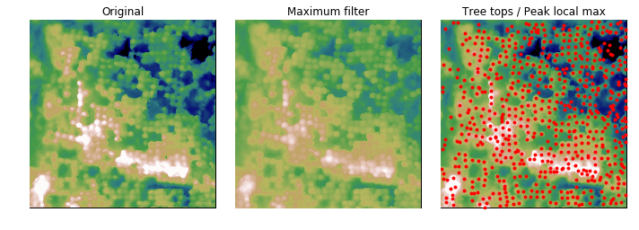

How to automatically counting trees using remotely sense data? Here, I'm going to share some method to do this by using Python.
I tried to do this in much more 'Pythonic' way, so i decide to use rasterio as a tool to import my data and
retain geographic information without any 'help' from GIS software :)

If you need to know more about rasterio check it out [here](https://rasterio.readthedocs.io/en/latest/), and a post by [Matthew T. Perry](https://www.perrygeo.com/python-affine-transforms.html) regarding on the affine transformation in rasterio.

This is an attempt to automatically counting trees based on [local maxima](http://scikit-image.org/docs/dev/api/skimage.feature.html#skimage.feature.peak_local_max) package from skimage.
For this tutorial, I will use canopy height model (CHM) as dataset to detect the highest point of canopy height.
To make sure you run this program successfully, make sure you already installed all packages below:
- [rasterio](https://pypi.org/project/rasterio/)
- [scikit-image](https://pypi.org/project/scikit-image/)
- [pandas](https://pypi.org/project/pandas/)
- [numpy](https://pypi.org/project/numpy/)
- [scipy](https://pypi.org/project/scipy/)


```python
import pandas as pd
import numpy as np
import rasterio
import matplotlib.pyplot as plt
from scipy import ndimage as ndi
from skimage.feature import peak_local_max
from skimage import exposure
```

Import CHM dataset into python using rasterio.


```python
raster = 'test_data.tif'
with rasterio.open(raster) as source:
    img = source.read(1) # Read raster band 1 as a numpy array
    affine = source.affine
```

rescale image to percentile, you may or may not need to do this.


```python
p2, p98 = np.percentile(img, (2, 98))
img_rescale = exposure.rescale_intensity(img, in_range=(p2, p98))
```

Applied Local maximum filtering using module [ndimage.maximum_filter()](https://docs.scipy.org/doc/scipy-0.16.0/reference/generated/scipy.ndimage.filters.maximum_filter.html)


```python
image_max = ndi.maximum_filter(img, size=3, mode='constant')
```

Locate maximum point based on [peak_local_max](http://scikit-image.org/docs/dev/api/skimage.feature.html#skimage.feature.peak_local_max)


```python
coordinates = peak_local_max(img, min_distance=2)
X=coordinates[:, 1]
y=coordinates[:, 0]

#reproject data array into original dataset
xs, ys = affine * (X, y)

# create some datasheet
df = pd.DataFrame({'X':xs, 'Y':ys})
```

Now, you can save each points from array into csv file.


```python
# count trees
count = df['X'].count()
print('Total trees : {i}'.format(i = count))
df.to_csv(r'test_output.csv')
```

    Total trees : 620


```python
fig, axes = plt.subplots(1, 3, figsize=(10, 10), sharex=True, sharey=True)
cmap=plt.cm.gist_earth
ax = axes.ravel()
ax[0].imshow(img_rescale, cmap)
ax[0].axis('off')
ax[0].set_title('Original')

ax[1].imshow(image_max, cmap)
ax[1].axis('off')
ax[1].set_title('Maximum filter')

ax[2].imshow(img_rescale, cmap)
ax[2].autoscale(False)
ax[2].plot(X,y, 'r.')
ax[2].axis('off')
ax[2].set_title('Tree tops')

fig.tight_layout()
plt.show()
```



Finally, you can export generated csv file into your favorite GIS software.
Happy mapping everyone!
