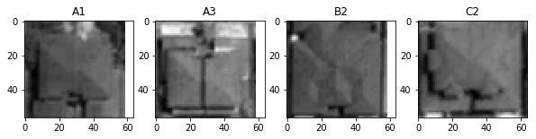
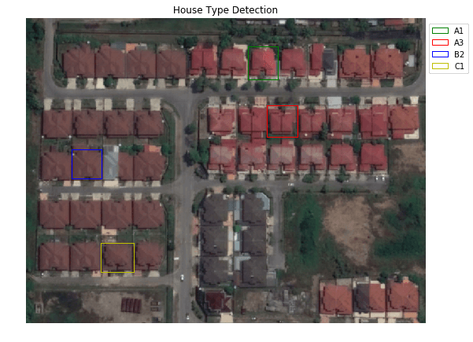

Considering that we need to find a new property eg., a new house based on the rooftop type, size of back/front-yard, floor-plan size or design of the house itself. To give us an idea where is this property located, remote sensing could be useful to predict these criteria.

Basically, this is just an example how to detect the property based on a given template. So, for this tutorial, I try to use clipped satellite images as the template datasets, and match it using skimage module in Python.

Let start with importing all required libraries.


```python
from PIL import Image
import numpy as np
import matplotlib.pyplot as plt
from skimage import data
from skimage.feature import match_template
```

Well, for this tutorial the image basically a subset from Google Earth.
We need to convert template images into arrays. The template image will be match with master image (which is basically a housing area).

```python
Imagehousing = np.asarray(Image.open('housing.png'))

sample1 = np.asarray(Image.open('A1.png'))
sample2 = np.asarray(Image.open('A3.png'))
sample3 = np.asarray(Image.open('B2.png'))
sample4 = np.asarray(Image.open('C2.png'))
```

We only working with one band (grescale image)


```python
houses = Imagehousing[:,:,1]
hm1 = sample1[:,:,1]
hm2 = sample2[:,:,1]
hm3 = sample3[:,:,1]
hm4 = sample4[:,:,1]
```

Lets plot our greyscale image.


```python
fig = plt.figure(figsize=(10, 10))
ax1 = plt.subplot(1, 4, 1)
ax2 = plt.subplot(1, 4, 2,sharex=ax1,sharey=ax1)
ax3 = plt.subplot(1, 4, 3,sharex=ax1,sharey=ax1)
ax4 = plt.subplot(1, 4, 4,sharex=ax1,sharey=ax1)

ax1.imshow(hm1, cmap=plt.cm.gray)
ax1.set_title('A1')

ax2.imshow(hm2, cmap=plt.cm.gray)
ax2.set_title('A3')

ax3.imshow(hm3, cmap=plt.cm.gray)
ax3.set_title('B2')

ax4.imshow(hm4, cmap=plt.cm.gray)
ax4.set_title('C2')
```




Now, we need to match our dataset into master image


```python
template_list = [hm1, hm2, hm3, hm4]
boxcolor = ['g', 'r', 'b', 'y']
labels = ["A1", "A3", "B2", "C1"]

fig = plt.figure(figsize=(20, 10))
ax = plt.subplot(1, 2, 1, adjustable='box-forced')

for i, color, label in zip(template_list,boxcolor,labels):
    result = match_template(houses, i)
    ij = np.unravel_index(np.argmax(result), result.shape)
    x, y = ij[::-1]

    match = match_template(houses, i)
    matchqry = np.where(match>0.80)

    ax.imshow(Imagehousing)
    ax.set_axis_off()
    ax.set_title('House Type Detection')
    # highlight matched region
    xax, yax = i.shape
    rect = plt.Rectangle((x, y), xax, yax, edgecolor=color, facecolor='none', label=label)
    ax.add_patch(rect)
    legend(loc='center left', bbox_to_anchor=(1, 0.9))
```

Viola! You can now detect your favorite house.


