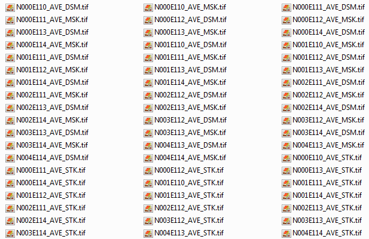

It must be a headache for those who work with satellite images if you have very low specs computer.
Plus you got tonnes of images to mosaic. As we know it is a time consuming, but hey..do we have solution for that.

Well, I try to simplify this workflow and implemented it just using [GDAL](https://www.gdal.org/) (Geospatial Data Abstraction Library).
__GDAL__ is a geospatial famous library for reading and writing raster and vector data formats.

We can do all of this by using [GDAL VRT (Virtual Format)](https://www.gdal.org/gdal_vrttut.html) which allow us to work
with virtual data. __VRT__ datasets will be save into __XML__ format file with extension name __*.vrt__.
So, this will save you a lots of space by running only in virtual data and it is a faster way to load many of datasets.

As an example, I will try to mosaic __DEM__ datasets within my file folder (*Basically you can use this for any geospatial images, that will be for next tutorial*). 



In my case, I want to mosaic all the __ALOS__ __PALSAR__ DEM in my folder.

```bash
cd \to\your\file\folder
gdalbuildvrt mosaic_dem.vrt *_DSM.tif
gdalwarp -t_srs EPSG:32649 -r bilinear -of GTiff mosaic_dem.vrt mosaic_dem.tif
```

So, that is it. Basically, you just mosaic your datasets and save it into __Geotiff__.