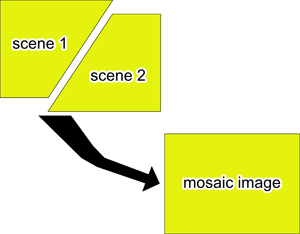

Mosaicking of remotely sensed datasets are essential requirement when our area of interest covering two or more of image footprints.

As mentioned in my previous [post](https://lerryws.xyz/posts/fast_and_furious_image_mosaic), __GDAL VRT__ can help us to save lots of space, and very helpful to speed-up your processing work-flow.

GDAL is like our swiss army knife, small and versatile. so here are tips on how to use __DAL VRT__ to help you in your projects either it big or small.

### 1. gdavbuildvrt for mosaicing satellite images.
If your area of interest covering two satellite's scene, you can run _gdalbuildvrt_ from command line.

```bash
gdalbuildvrt mosaic.vrt scene1.tif scene2.tif
```
In case you have more images to mosaic, you can list all the images into __*.txt__ file.
```bash
gdalbuildvrt -input_file_list image_scene_list.txt mosaic.vrt
```

### 2. Merge satellite images into RGB or composite.
It is possible to create RGB image, by using different combination of bands.
Let say we have _landsat 7_ dataset which have Band1, Band2, Band3, Band4, etc... in our dataset and we need to merge them to create a new composite image. Remember the combination will be Red, Blue, and Green.
So, when we run _gdalbuildvrt_ it will be like this
```bash
gdalbuildvrt RGB_Image.vrt Band3.tif Band2.tif Band1.tif
```
To create composite images, we add _-separate_ into the command line.
```bash
gdalbuildvrt -separate Composite_image.vrt Band1.tif Band2.tif band3.tif Band4.tif Band5.tif
```
or, just make a list of your images into __*.txt__ file
```bash
gdalbuildvrt -separate -input_file_list image_scene_list.txt Composite_image.vrt
```

If you want to learn more about gdalbuildvrt you can visit [here](https://www.gdal.org/gdalbuildvrt.html) and [here](https://www.gdal.org/gdal_vrttut.html).
