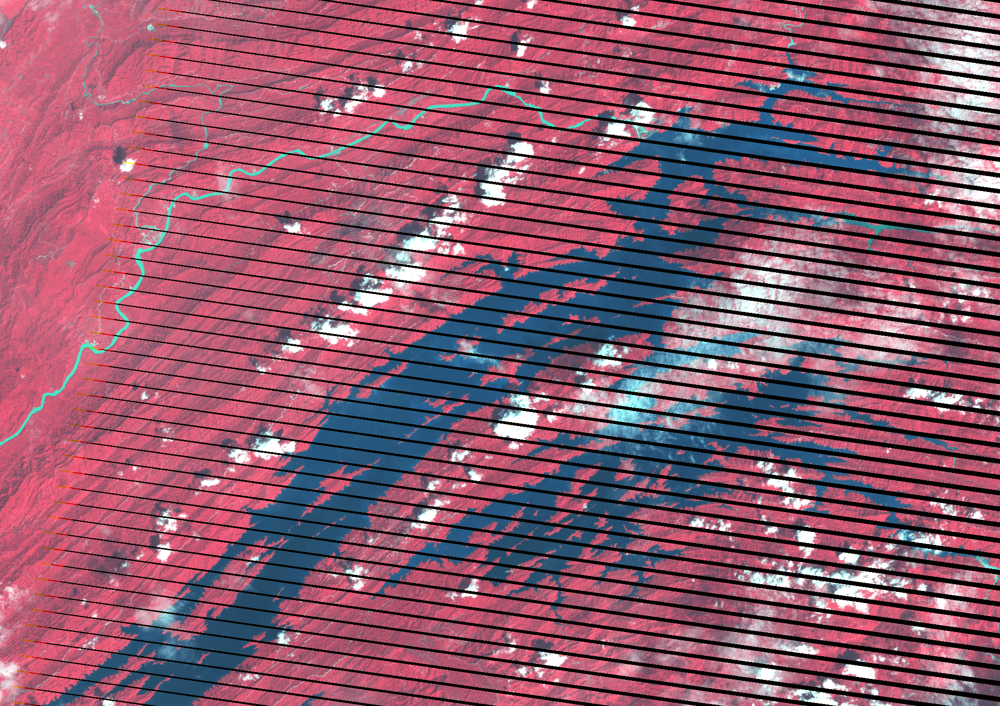
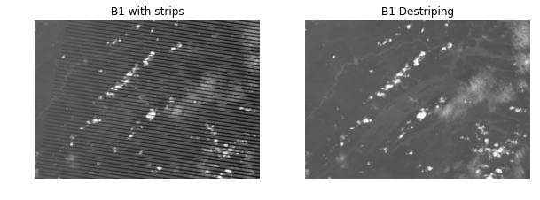
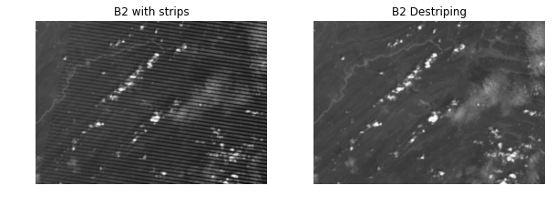
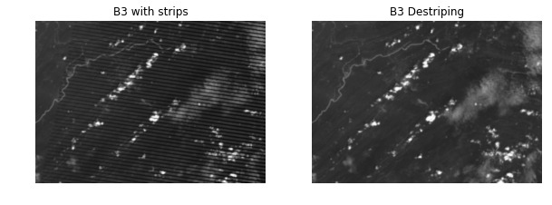
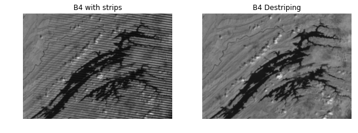
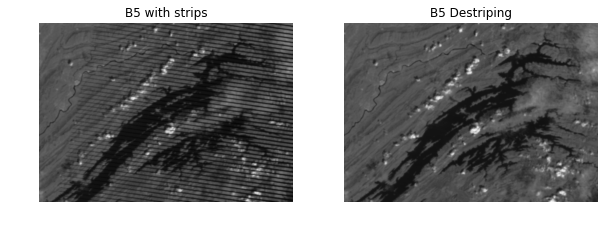
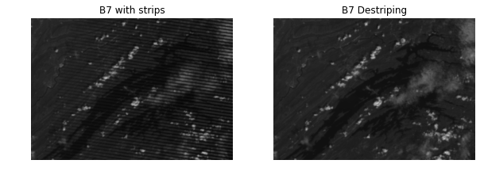
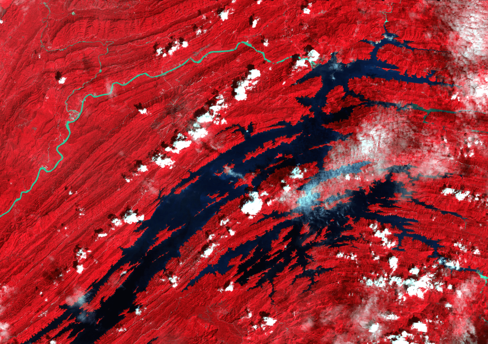

Remote sensing is a fun game until you are dealing with abnormal datasets, it could be clouds cover %, radiometric effect, and _striping effect_!



{:.image-caption}
*Landsat 7 ETM+ before destriping*

If you are working with Landsat-7 ETM+ then you are likely to encounter striping effect caused by scan line corrector (SLC) failure since 2003. In case we need to do some study or looking for historic data that dated back to 2003 for our area of interest (AOI), then definitely we need to correct or destripe this striping effect.

There are few methods that has been developed to encounter this problems such as:
- A method developed in ERDAS. Check it [here](https://landsat.usgs.gov/filling-gaps-use-scientific-analysis)
- Landsat Gapfill IDL Model. Download it [here](s3.amazonaws.com/nrcs-sgi/EvansModels/landsat_gapfill.sav)
- gdal_fillnodata from GDAL and has been applied into QGIS core system.

I have been using the [inpainting](https://en.wikipedia.org/wiki/Inpainting) technique in my previous work, which I never published or shared to public before. Technically it has been use in digital image processing for image restoration in Adobe® Photoshop called "Content-Aware Fill" and GIMP called "Resynthesizer" (plugin [here](http://inpaintgimpplugin.github.io/)).

In order to apply this method I used OpenCV and Python to help me with image processing. OpenCV inpainting module is based on [Alexandru Telea's](https://doi.org/10.1080/10867651.2004.10487596) paper and the second algorithm which is based on algorithm developed by [Marcelo Bertalmio, et al.](https://conservancy.umn.edu/handle/11299/3607)

Here the Python's dependencies you need to install before running this method.
- rasterio
- opencv python wrapper

Install dependencies using python using this command:


```python
pip install rasterio
```


```python
pip install opencv-python
```

Go through the code below to learn more!


```python
import rasterio as rio
import cv2
from matplotlib import pyplot as plt
```


```python
B1 = 'B1.tif'
B2 = 'B2.tif'
B3 = 'B3.tif'
B4 = 'B4.tif'
B5 = 'B5.tif'
B7 = 'B7.tif'
mask_B1 = cv2.imread('gap_b1_mask.tif',0)
mask_B2 = cv2.imread('gap_b2_mask.tif',0)
mask_B3 = cv2.imread('gap_b3_mask.tif',0)
mask_B4 = cv2.imread('gap_b4_mask.tif',0)
mask_B5 = cv2.imread('gap_b5_mask.tif',0)
mask_B7 = cv2.imread('gap_b7_mask.tif',0)

bands = [B1,B2,B3,B4,B5,B7]
names = ['B1','B2','B3','B4','B5','B7']
mask_paths = [mask_B1,mask_B2,mask_B3,mask_B4,mask_B5,mask_B7]

for raster, mask, name in zip(bands, mask_paths, names):
    with rio.open(raster) as src:
        img = src.read(1) # Read raster band 1 as a numpy array
        src.transform
        src.crs

        # alg 1 : cv2.INPAINT_TELEA ; alg 2 : cv2.INPAINT_NS
        dst = cv2.inpaint(img,mask,3,cv2.INPAINT_TELEA) # Magic happen here!

        fig, axes = plt.subplots(1, 2, figsize=(10, 10), sharex=True, sharey=True)
        cmap=plt.cm.Greys_r
        ax = axes.ravel()
        ax[0].imshow(img, cmap, interpolation = 'bicubic')
        ax[0].axis('off')
        ax[0].set_title(name+' with strips')
        ax[1].imshow(dst, cmap, interpolation = 'bicubic')
        ax[1].axis('off')
        ax[1].set_title(name+' Destriping')

        #save data to your folder
        with rio.open('to/your/output/folder'+ name +'.tif', 'w',
                      driver='GTiff',
                      height=src.shape[0],
                      width=src.shape[1],
                      count=1,
                      dtype=rio.uint8,
                      crs=src.crs,
                      transform = src.transform) as out:
            out.write(dst, 1)
```





















{:.image-caption}
*Landsat 7 ETM+ after destriping*

I hope this tutorial can help you in your interesting project. Hit me up is there any questions regarding on this articles.
