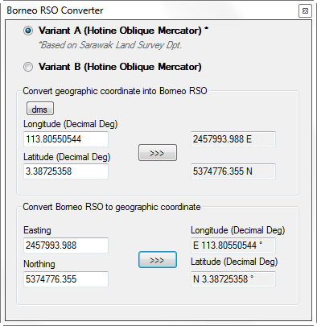
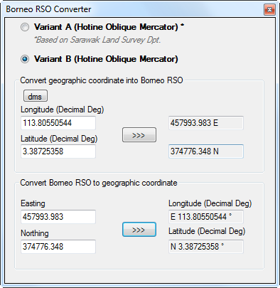

__Coordinate Projection!__ yes, one of the most important element in mapping. When it come to coordinate projection and transformation I take it seriously. Since the end result could affect a lot of end user and even the project itself. Understanding of coordinate projection is essential for geospatialist and also anyone who work with geographic data.

Coordinate systems, map projections, and geographic transformations are blueprints and backbone of map production, because without them, you end up just making a _graphic_ and not geo-graphic 😃

You might be interested to know more about [Coordinate systems, map projections, and geographic transformations](http://resources.esri.com/help/9.3/arcgisengine/dotnet/89b720a5-7339-44b0-8b58-0f5bf2843393.htm), you can check the source from
[here](https://gisgeography.com/latitude-longitude-coordinates/), [here](https://www.e-education.psu.edu/natureofgeoinfo/c2_p10.html),
or maybe more deeper into it [here](https://en.wikipedia.org/wiki/Geographic_coordinate_conversion).

OK, lets back to our main topic.. __Borneo RSO (Rectified Skew Orthomorphic)__ or __BRSO__, is a coordinate system that use in East Malaysia and also Brunei. Usually the EPSG code for BRSO that used within any GIS software are [29871](https://epsg.io/29871), [29872](https://epsg.io/29872), or [29873](https://epsg.io/29873).

I have been writing a simple converter BRSO > WGS84 > BRSO for my own use, and interested to share it with you guys!

First of all lets see what are the parameter for BRSO EPSG:29873 :

```css
PROJCS["Timbalai 1948 / RSO Borneo (m)",
    GEOGCS["Timbalai 1948",
        DATUM["Timbalai_1948",
            SPHEROID["Everest 1830 (1967 Definition)",6377298.556,300.8017,
                AUTHORITY["EPSG","7016"]],
            TOWGS84[-679,669,-48,0,0,0,0],
            AUTHORITY["EPSG","6298"]],
        PRIMEM["Greenwich",0,
            AUTHORITY["EPSG","8901"]],
        UNIT["degree",0.0174532925199433,
            AUTHORITY["EPSG","9122"]],
        AUTHORITY["EPSG","4298"]],
    PROJECTION["Hotine_Oblique_Mercator_Azimuth_Center"],
    PARAMETER["latitude_of_center",4],
    PARAMETER["longitude_of_center",115],
    PARAMETER["azimuth",53.31582047222222],
    PARAMETER["rectified_grid_angle",53.13010236111111],
    PARAMETER["scale_factor",0.99984],
    PARAMETER["false_easting",590476.87],
    PARAMETER["false_northing",442857.65],
    UNIT["metre",1,
        AUTHORITY["EPSG","9001"]],
    AXIS["Easting",EAST],
    AXIS["Northing",NORTH],
    AUTHORITY["EPSG","29873"]]
```

or in Proj.4 format :

```css
+proj=omerc +lat_0=4 +lonc=115 +alpha=53.31582047222222 +k=0.99984 +x_0=590476.87 +y_0=442857.65 +gamma=53.13010236111111 +ellps=evrstSS +towgs84=-679,669,-48,0,0,0,0 +units=m +no_defs
```

The parameter above is the default value within GIS software, but we have a special case in Sarawak since the Sarawak Land & Survey Department have been using modified version of the BRSO where false Easting and Northing are 2000000 and 5000000 such stated below:

```css
PROJCS["Timbalai 1948 / RSO Borneo (m)",
    GEOGCS["Timbalai 1948",
        DATUM["Timbalai_1948",
            SPHEROID["Everest 1830 (1967 Definition)",6377298.556,300.8017,
                AUTHORITY["EPSG","7016"]],
            TOWGS84[-679,669,-48,0,0,0,0],
            AUTHORITY["EPSG","6298"]],
        PRIMEM["Greenwich",0,
            AUTHORITY["EPSG","8901"]],
        UNIT["degree",0.0174532925199433,
            AUTHORITY["EPSG","9122"]],
        AUTHORITY["EPSG","4298"]],
    PROJECTION["Hotine_Oblique_Mercator_Azimuth_Center"],
    PARAMETER["latitude_of_center",4],
    PARAMETER["longitude_of_center",115],
    PARAMETER["azimuth",53.31582047222222],
    PARAMETER["rectified_grid_angle",53.13010236111111],
    PARAMETER["scale_factor",0.99984],
    PARAMETER["false_easting",2000000],
    PARAMETER["false_northing",5000000],
    UNIT["metre",1,
        AUTHORITY["EPSG","9001"]],
    AXIS["Easting",EAST],
    AXIS["Northing",NORTH],
    AUTHORITY["EPSG","29873"]]
```

while for Proj.4 format it will be like this:

```css
+proj=omerc +lat_0=4 +lonc=115 +alpha=53.31582047222222 +gamma=53.13010236111111 +k=0.99984 +x_0=2000000 +y_0=5000000 +no_uoff +ellps=evrstSS +towgs84=-679,669,-48,0,0,0,0 +units=m +no_defs
```

For now, let see what I have been done using those parameter.
I have been writing this program to help me for conversion of the coordinate system without me to open any of GIS software.
Here are the snapshots for a program I wrote and if you are interested to try it you can download it from [__here__](../assets/data/brso_setup.msi).

{: .center-image }
*BRSO Variant A*

{: .center-image }
*BRSO Variant B*

If there any questions regarding on this article, please do not hesitate to contact me.
