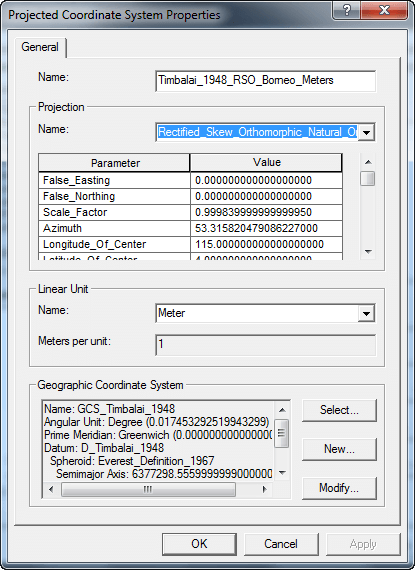

How to modify Borneo RSO within your Arcgis environment? Please follow steps given below :

__Note: This tutorial is based on Arcgis 9.3. Same method applied for ArcGIS 10.++.__

1.Run Arcmap and go to _View_ > _Data Frame Properties_


2.In Data Frame Properties window go to _Select a coordinate system:_ box, then browse to _Projected Coordinate System_ > _National Grids_ > _Malaysia_ > _Timbalai 1948 RSO Borneo Meters_, then click _Modify_ button.


3.Change _False_Easting_ and _False_Northing_ parameter value into __2000000__ and  __5000000__. Rename it into BRSO.




4.Once you clicked OK, it will appear in _custom_ directory. You can save it by clicking _Add To Favorites_ button.


5.__Or__ you can create a _*.prj_ which is a default projection file for __ESRI__ product. Use your favorite text editor such as notepad or notepad++ to write  __ESRI WKT__ format. Copy the __ESRI WKT__ format file below:

```
PROJCS["Timbalai_1948_RSO_Borneo_Meters",GEOGCS["GCS_Timbalai_1948",DATUM["D_Timbalai_1948",SPHEROID["Everest_Definition_1967",6377298.556,300.8017]],PRIMEM["Greenwich",0.0],UNIT["Degree",0.0174532925199433]],PROJECTION["Rectified_Skew_Orthomorphic_Natural_Origin"],PARAMETER["False_Easting",2000000.0],PARAMETER["False_Northing",5000000.0],PARAMETER["Scale_Factor",0.99984],PARAMETER["Azimuth",53.31582047908623],PARAMETER["Longitude_Of_Center",115.0],PARAMETER["Latitude_Of_Center",4.0],PARAMETER["XY_Plane_Rotation",53.13010235415598],UNIT["Meter",1.0]]
```

Copy and save it as __'Timbalai 1948 Borneo RSO.prj'__ inside the ArcGIS Coordinate Systems directory, in my case it is in "C:\Program Files (x86)\ArcGIS\Coordinate Systems\Projected Coordinate Systems\National Grids\Malaysia".

__Happy mapping!__
