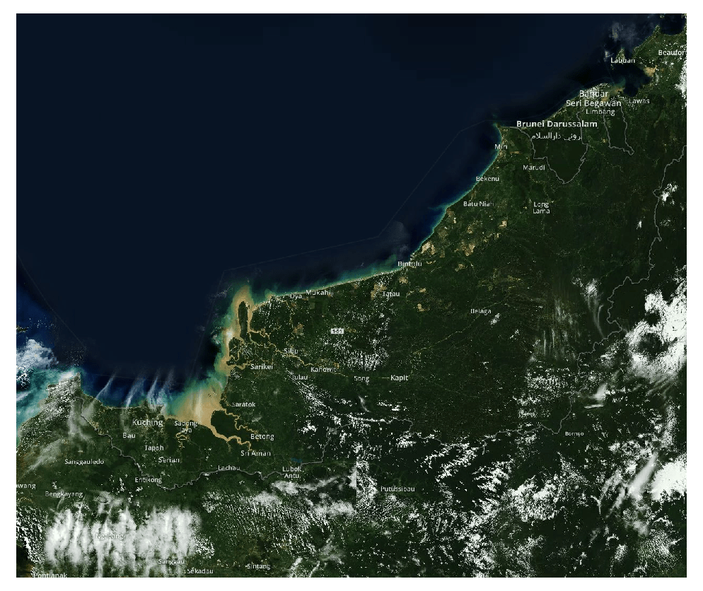
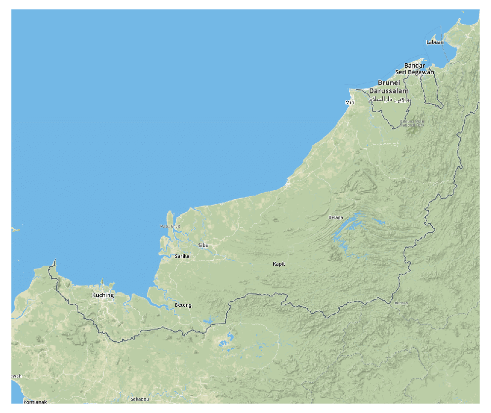
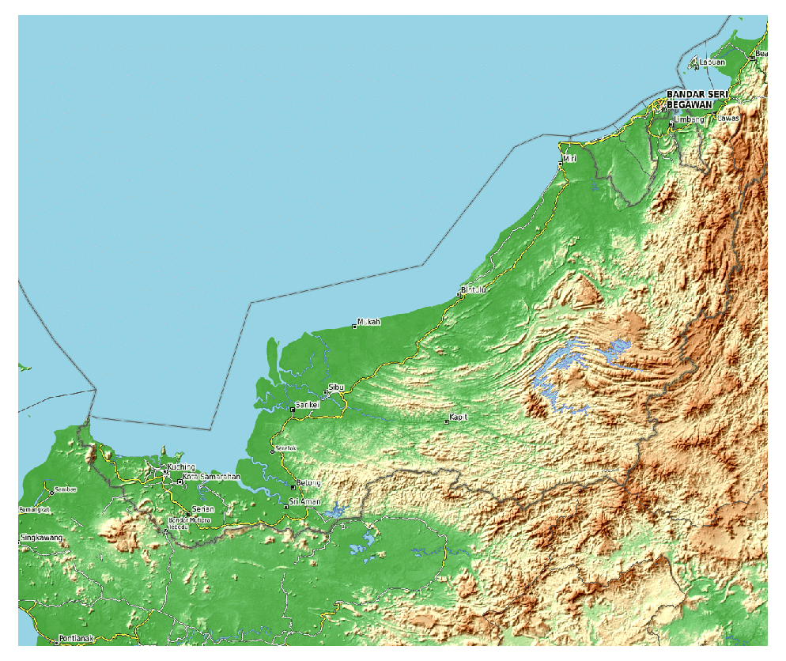
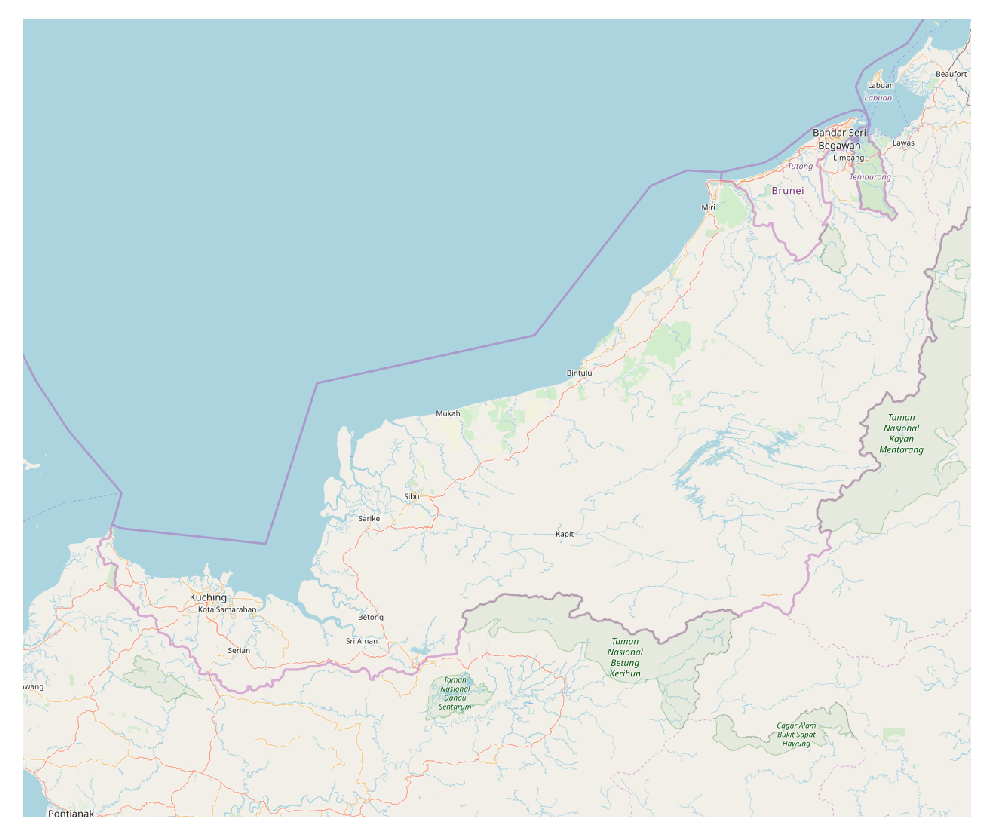
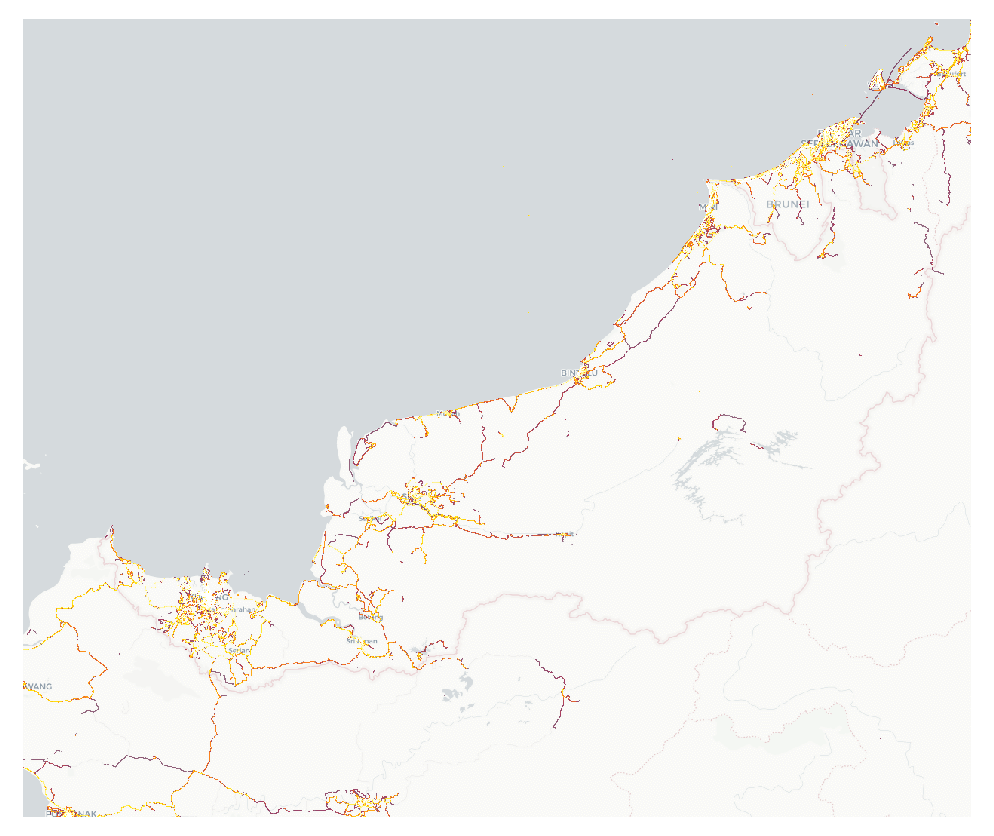
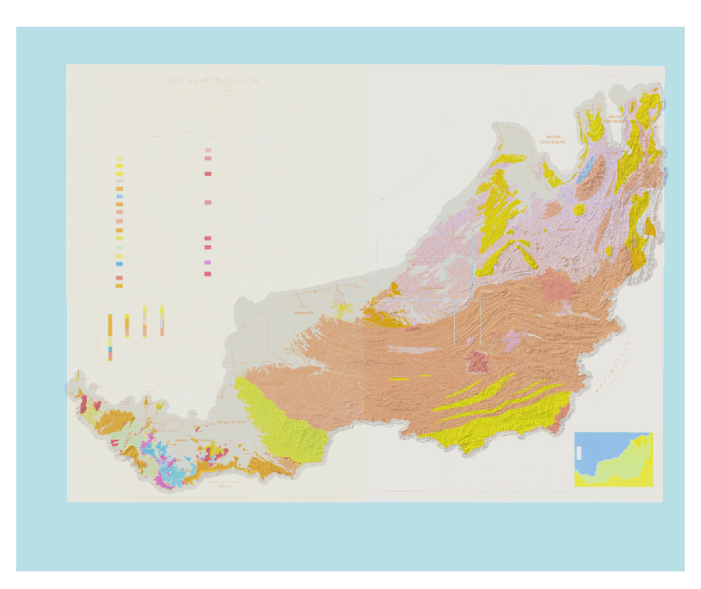

A WMTS capabilities file which is an XML, a standard protocol for serving pre-rendered or run-time computed georeferenced map tiles over the Internet.

Basically, WMTS request the capabilities, tile, featureinfo, or legend and return all the information into the map.

There a lot of WMTS service you can find in the Interent, but my interest is only for Sarawak region. So I write an XML capabilities to fetch various map tiles from it sources. The pre-rendered map tiles from difference sources such as [Mapbox](https://www.mapbox.com/), [OpenStreetmap](www.openstreetmap.org), [Carto](https://carto.com/), [Strava](https://www.strava.com/) and my own tiles has been added into the WMTS capabilities.

Copy this URL into your favourite GIS software, or fetch the URL in your web mapping project to use the service.

```
https://tiles.lerryws.xyz/capabilities/lws.wmts.xml
```

<div id='map' style="width: 100%; height: 600px;"></div>

<link rel="stylesheet" href="/css/leaflet.css">
<script type="text/javascript" src="../js/leaflet.js"></script>
<script src="https://rawgithub.com/mylen/leaflet.TileLayer.WMTS/master/leaflet-tilelayer-wmts.js"></script>

<script>
  var mapbox_sat = L.tileLayer('https://a.tiles.mapbox.com/v3/brightrain.map-bpwe9yas/{z}/{x}/{y}.png', {
    	maxZoom: 19,
    	attribution: '© <a href="https://www.mapbox.com/about/maps/">Mapbox</a> © <a href="http://www.openstreetmap.org/copyright">OpenStreetMap</a>'
    }),
  OpenTopoMap = L.tileLayer('https://{s}.tile.opentopomap.org/{z}/{x}/{y}.png', {
  	maxZoom: 19,
  	attribution: 'Map data: &copy; <a href="https://www.openstreetmap.org/copyright">OpenStreetMap</a> contributors, <a href="http://viewfinderpanoramas.org">SRTM</a> | Map style: &copy; <a href="https://opentopomap.org">OpenTopoMap</a> (<a href="https://creativecommons.org/licenses/by-sa/3.0/">CC-BY-SA</a>)'
    }),
  geomap = L.tileLayer('https://tiles.lerryws.xyz/sarawak_geological_map/{z}/{x}/{y}.png', {
    attribution: 'LWS'
    });

  var corner1  = L.latLng(-0.04073073, 108.99437294),
    corner2  = L.latLng(5.75707846, 115.89948784);
  var bounds = L.latLngBounds(corner1, corner2 );

  var map = L.map('map', {
      center: [2.750239, 112.996826],
      maxBounds: bounds,
      zoom: 8,
      maxZoom: 19,
      minZoom: 8,
      layers: [mapbox_sat, OpenTopoMap, geomap]
  });

  map.fitBounds([
      [-0.04073073, 108.99437294],
      [5.75707846, 115.89948784]
  ]);

  var baseMaps = {
      "Mapbox Satellite": mapbox_sat,
      "OpenTopoMap": OpenTopoMap,
      "Geology map": geomap,
  };

  L.control.layers(baseMaps, {}, {collapsed: false}).addTo(map);
</script>

Take a look at the snapshot of map tiles requested from WMTS. I hope this can help you in your project.

{: .center-image }
*Mapbox Satellite tiles ©️ Mapbox*

{: .center-image }
*Mapbox Street tiles ©️ Mapbox*

{: .center-image }
*OpenTopoMap tiles ©️ OpenTopoMap*

{: .center-image }
*OpenStreetMap tiles ©️ OpenStreetMap*

{: .center-image }
*Strava hotspot tiles ©️ Strava*

{: .center-image }
*Customize tiles generated from Sarawak Geological Map. Data from Malaysia Mineral and Geoscience Department (JMG)*
