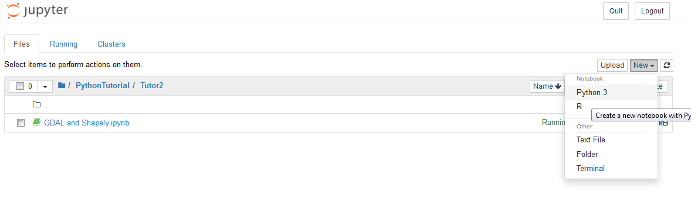

# Setup Jupyter Notebook's working directory

We already setup our python environment in [this tutorial](https://lerryws.xyz/posts/Setup-geospatial-environment-in-Anaconda), so let move forward to the next step where we going to setup our working directory. For this tutorial I will using Jupyter Notebook, but before that lets setup and prepare our workspace.

First, lets check a list of available environment within Anaconda. From previous tutorial we already created an environment called 'geopy'. Type this command in the Anaconda terminal to check our environment:

```bash
conda env list
```

{: .center-image }

As you can see, the output will be a list of available environment. OK, lets activate the 'geopy' environment.

```bash
conda activate geopy
```
{: .center-image }

We are in our 'geopy' environment now and next we will create a configuration file `jupyter_notebook_config.py`. Create this file using following command line:

```bash
jupyter notebook --generate-config
```
Check that file in your home directory, usually for Windows user it is in `%userprofile%/.jupyter`.
In my case it is in `C:\Users\lerryw\.jupyter`, open `jupyter_notebook_config.py` and edit the line with `# c.NotebookApp.notebook_dir`. Remove __#__ sign and write the working directory at the end of the line.

{: .center-image }

For this tutorial I have created a folder named `C:\PythonTutorial` and I need the notebook server to be run within this directory.

So now we can start running the Jupyter Notebook by following command line:

```bash
jupyter notebook
```
The notebook server address will be directed to `http://localhost:8888/tree` and it will open automatically in your favourite browser.

Viola..! now you can start working in Jupyter Notebook.

Create a new notebook by clicking a `New` button then select `Python 3`
{: .center-image }
