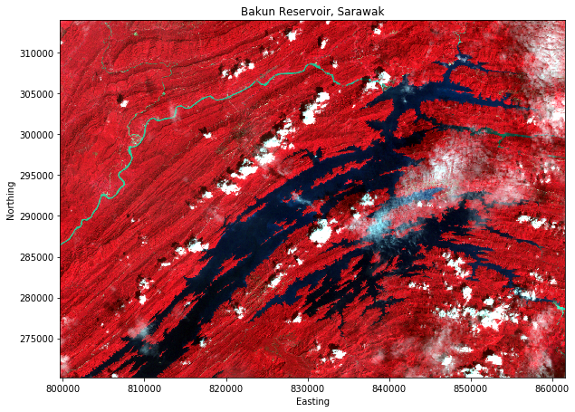

# Geospatial raster using GDAL in Python

Get to know how to use GDAL in python... But first, if you do not following my previous tutorial, you can install GDAl module by this command line:

```bash
conda install -c conda-forge gdal
```

To check whether GDAL is successfully installed or not, lets check it by following command in the terminal:

```bash
conda list gdal
```
There will be a list of installed modules in our environment, if GDAL is in the list, then we are good to go..

## Access geospatial raster data

Download the dataset used in this tutorial from [here](../assets/data.rar). This python code will access your raster data:

```python
from osgeo import gdal, osr

# set dataset filepath (change to your raster data)
filepath=r"./data/img.tif"
# open dataset
ds = gdal.Open(filepath)
#convert image to array
img = ds.ReadAsArray()
#get data transformation
trans = ds.GetGeoTransform()
#get projection
proj = ds.GetProjection()
```

Whenever you working with raster data, it is a good practice for you to convert your image into array, since python using array for calculation when we are doing further analysis such as image processing or image classification (I will discuss this in next tutorial).

Our goal for this tutorial is to display our data into Jupyter Notebook, so before that we need to import matplotlib library to our script, so we can plot our image.

```python
import matplotlib.pyplot as plt
```

To map our 2D image, we will need to define our image extent (X1,X2,Y1,Y2), where:
- X1 : minimum X
- X2 : maximum X
- Y1 : minimum Y
- Y2 : maximum Y

From `trans = ds.GetGeoTransform()` we need to define our trasnformation origins, rotation and size. GDAL format will be like this: orientation X, size X, rotation X, orientation Y, rotation Y, size Y

Which can be translate into:
```python
xo, xs, xr, yo, yr, ys = trans
```
Note that in GDAL transformation format, the first variable would be `[0]`, second variable will be `[1]`, and so on..

- trans[0] : xo
- trans[1] : xs
- trans[2] : xr
- trans[3] : yo
- trans[4] : yr
- trans[5] : ys

Next we need to define the dimension of our image:
```python
# Dimensions
X = ds.RasterXSize
Y = ds.RasterYSize
print (X,Y)
```
Lets define the extent (X1,X2,Y1,Y2), by following:
```python
#get dataset extent
extent = (xo, xo + X*xs,
          yo + Y*yr, yo)
```

or following below if we do not yet defined the size of X,Y and transformation variables.

```python
#get dataset extent
extent = (trans[0], trans[0] + ds.RasterXSize*trans[1],
          trans[3] + ds.RasterYSize*trans[5], trans[3])
```
## Plot geospatial raster data

Finally, we will able to plot our geospatial raster data by following below:
```python
plt.figure(figsize=(10,10))
plt.imshow(img[:3,:,:].transpose((1, 2, 0)), extent=extent)
plt.title('Bakun Reservoir, Sarawak')
plt.xlabel('Easting')
plt.ylabel('Northing')
plt.show()
```
The output :

{: .center-image }

Our final code will be like this:
```python
from osgeo import gdal, osr
import matplotlib.pyplot as plt

# open dataset
filepath=r"./data/img.tif"
ds = gdal.Open(filepath)
# convert image to array
img = ds.ReadAsArray()
# get data transformation
trans = ds.GetGeoTransform()
# get projection
proj = ds.GetProjection()

# trasnformation variables
xo, xs, xr, yo, yr, ys = trans
print(xo, xs, xr, yo, yr, ys)

# Dimensions
X = ds.RasterXSize
Y = ds.RasterYSize
print (X,Y)

#get dataset extent
extent = (xo, xo + X*xs,
          yo + Y*yr, yo)
print(extent)
'''
# or using this method if we do not yet defined X and Y size of raster data.
# get dataset extent
extent = (trans[0], trans[0] + ds.RasterXSize*trans[1],
          trans[3] + ds.RasterYSize*trans[5], trans[3])
print(extent)
'''

# Plot using matplotlib
plt.figure(figsize=(10,10))
plt.imshow(img[:3,:,:].transpose((1, 2, 0)), extent=extent)
plt.title('Bakun Reservoir, Sarawak')
plt.xlabel('Easting')
plt.ylabel('Northing')
plt.show()
```
You also can download jupyter notebook of this tutorial from [here](../assets/tutorial/GDAL_raster.ipynb).
